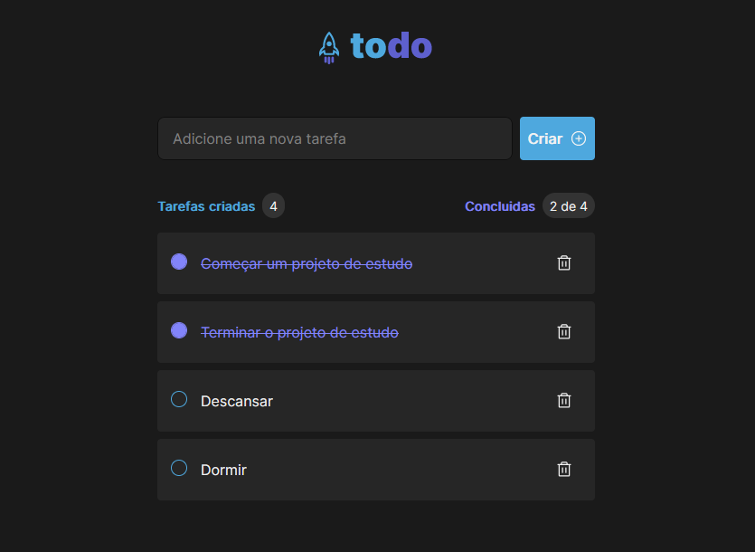

# Desafio: Praticando Conceitos

## Ignite - Trilha ReactJS

Desafio 01 - Praticando os conceitos do ReactJS

Reforçar os conceitos mais importantes do ReactJS, estudar e aprender mais conceitos que serão utilizados em todas futuras aplicações.
Nesse desafio, é desenvolvido uma aplicação de controle de tarefas no estilo ToDo List, que contém as seguintes funcionalidades:

- [x] Adicionar um nova tarefa
- [x] Marcar e desmar uma tarefa com concluidas
- [x] Remover um tarefa da listagem
- [x] Mostrar o quantidade de tarefas criadas e concluidas



## Tecnologias

- [Vite](https://vitejs.dev/)
- [ReactJS](https://pt-br.reactjs.org/)
- [UnoCSS](https://github.com/unocss/unocss)
- [Typescript](https://www.typescriptlang.org/)

## Configurações do Projeto

```bash
# install dependencies
$ yarn install

# serve with hot reload at localhost:3000
$ yarn dev

```

---

2022 - [github.com/fernandoprestes](https://github.com/fernandoprestes)
